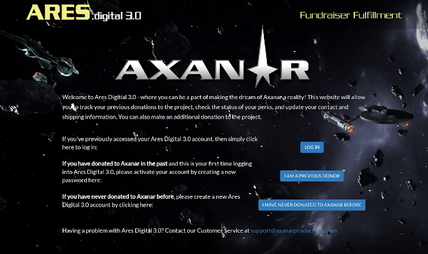
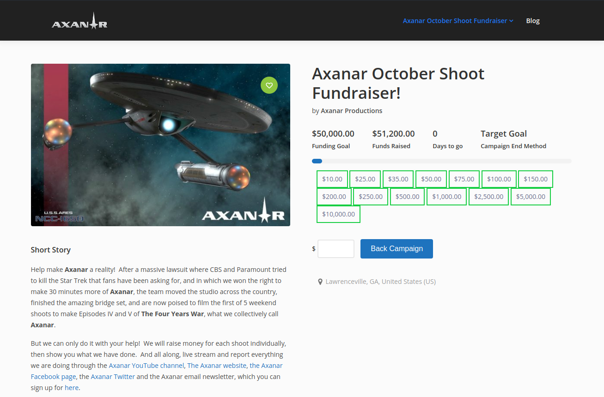

# Axanar Crowd Funding Fulfillment Website

I have served as the Chief Software Engineer in charge of system administration, web development and customer support since July 2019, which is a volunteer position.  I was an original Kickstarter supporter for the first campaign, and in July 2019, Alec Peters posted a request for a PHP developer on the Axanar Donors Facebook group and after chatting with him, found myself in charge of website administration and development.

This is the Laravel codebase for https://aresdigital.axanar.com/, a crowd funding fulfillment website for the Star Trek fan film Prelude to Axanar.  In 2014, Prelude to Axanar, was released, funded by 2 Kickstarter and 1 Indiegogo crowdfunding campaigns. This is a membership fulfillment website for donors for these campaigns.

In December of 2019, I created a WordPress site for a new private fundraising campaign (only past donors or those already on the Axanar email list could contribute due to licensing agreement with Paramount) which raised over $50,000 in 45 days, which provided funding for two additional episodes of Axanar.  For this, I used plugins to import users from the fulfillment site and sign into the WordPress sites using credentials from the fulfillment website. 

## Prelude to Axanar Movie

## Homepage of Ares.digital 3.0

## Homepage of Private Funding Campaign

